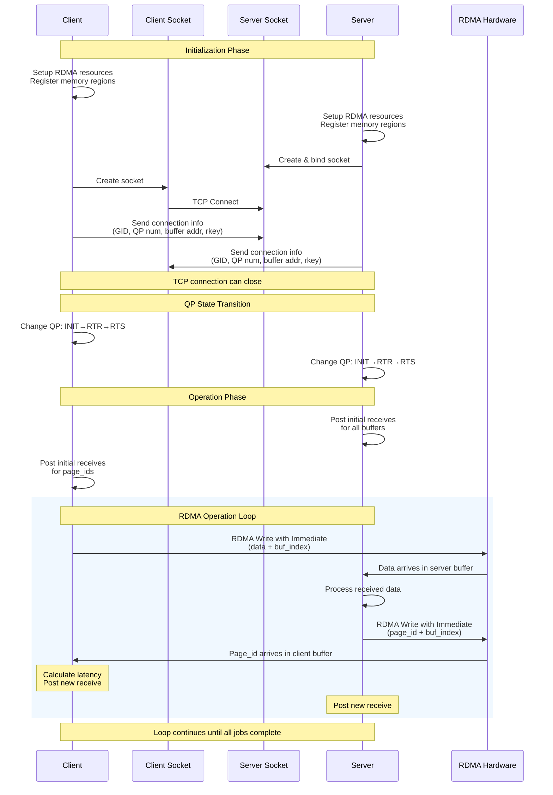

# rdma_app

```mermaid
sequenceDiagram
    participant C as Client
    participant CS as Client Socket
    participant SS as Server Socket
    participant S as Server
    participant HW as RDMA Hardware

    Note over C,S: Initialization Phase
    C->>C: Setup RDMA resources<br/>Register memory regions
    S->>S: Setup RDMA resources<br/>Register memory regions
    S->>SS: Create & bind socket
    C->>CS: Create socket
    CS->>SS: TCP Connect
    C->>SS: Send connection info<br/>(GID, QP num, buffer addr, rkey)
    S->>CS: Send connection info<br/>(GID, QP num, buffer addr, rkey)
    Note over C,S: TCP connection can close

    Note over C,S: QP State Transition
    C->>C: Change QP: INIT→RTR→RTS
    S->>S: Change QP: INIT→RTR→RTS
    
    Note over C,S: Operation Phase
    S->>S: Post initial receives<br/>for all buffers
    C->>C: Post initial receives<br/>for page_ids
    
    rect rgb(240, 248, 255)
        Note over C,S: RDMA Operation Loop
        C->>HW: RDMA Write with Immediate<br/>(data + buf_index)
        HW->>S: Data arrives in server buffer
        S->>S: Process received data
        S->>HW: RDMA Write with Immediate<br/>(page_id + buf_index)
        HW->>C: Page_id arrives in client buffer
        Note over C: Calculate latency<br/>Post new receive
        Note over S: Post new receive
    end

    Note over C,S: Loop continues until all jobs complete
```
